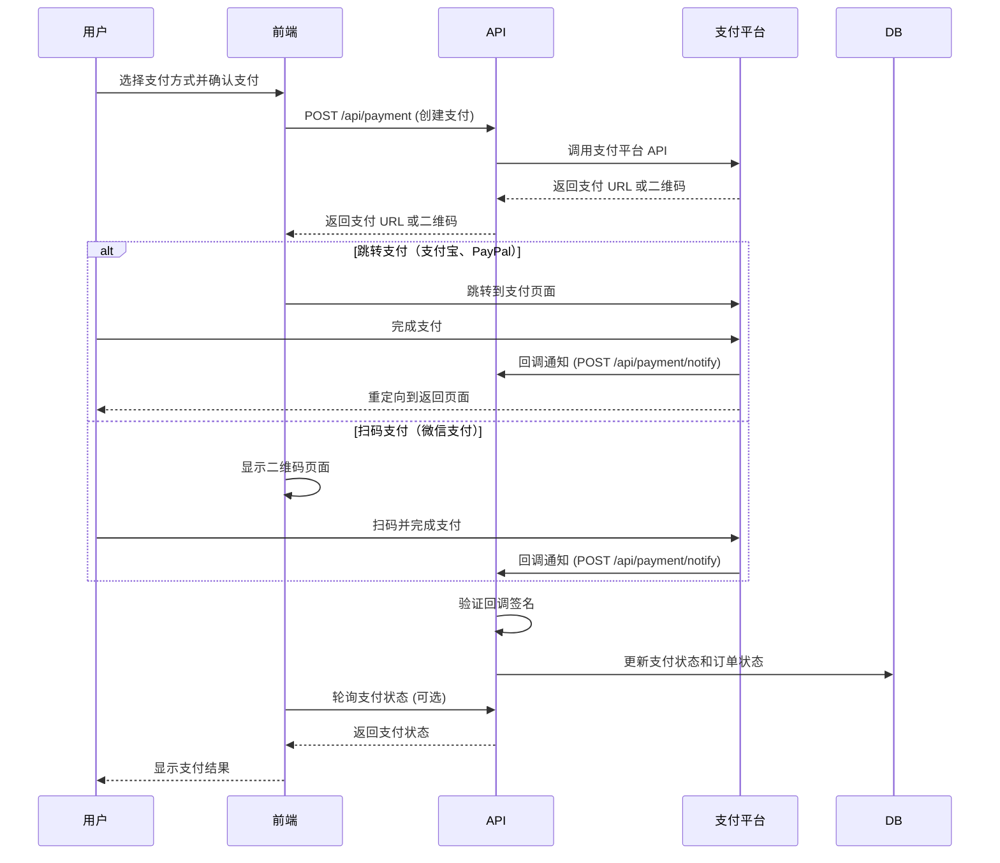

# 支付系统测试指南 - TalkyOne 项目

**创建时间**: 2026年6月14日 22:01
**状态**: ✅ 支付系统框架已完成，待测试

---

## 📋 支付系统架构

### 支持的支付方式
1. **支付宝** - Alipay
2. **微信支付** - WeChat Pay
3. **PayPal** - PayPal

### 支付流程



---

## 🧪 测试准备

### 1. 环境配置

#### 创建环境变量文件
```bash
cd talkyone
cp .env.example .env.local
```

#### 配置测试环境凭据

##### 支付宝沙箱环境
1. 访问 [支付宝开放平台沙箱环境](https://openhome.alipay.com/platform/appDaily.htm)
2. 登录支付宝开发者账号
3. 获取沙箱应用信息：
   - APPID
   - 商户私钥
   - 支付宝公钥
   - 支付宝网关（沙箱环境）
4. 填写到 `.env.local`:
```env
ALIPAY_APP_ID="你的沙箱APPID"
ALIPAY_PRIVATE_KEY="你的商户私钥"
ALIPAY_PUBLIC_KEY="你的支付宝公钥"
ALIPAY_GATEWAY="https://openapi.alipaydev.com/gateway.do"
```

##### 微信支付沙箱环境
1. 访问 [微信支付服务商平台](https://pay.weixin.qq.com/)
2. 注册开发者账号并创建测试应用
3. 获取测试凭据：
   - 商户号 (mch_id)
   - API 证书序列号
   - 商户私钥
   - API v3 密钥
4. 填写到 `.env.local`:
```env
WECHAT_MCH_ID="你的商户号"
WECHAT_CERT_SERIAL_NO="你的证书序列号"
WECHAT_PRIVATE_KEY="你的商户私钥"
WECHAT_API_V3_KEY="你的API v3密钥"
WECHAT_APP_ID="你的AppID"
```

##### PayPal 沙箱环境
1. 访问 [PayPal Developer](https://developer.paypal.com/)
2. 登录并创建应用
3. 获取 Sandbox 凭据：
   - Client ID
   - Client Secret
4. 填写到 `.env.local`:
```env
PAYPAL_CLIENT_ID="你的Client ID"
PAYPAL_CLIENT_SECRET="你的Client Secret"
PAYPAL_ENV="sandbox"
```

### 2. 数据库准备

#### 运行数据库迁移
```bash
# 生成 Prisma Client
npx prisma generate

# 运行迁移
npx prisma migrate dev

# 创建测试数据
npx prisma db seed
```

#### 检查测试数据
```bash
# 打开 Prisma Studio
npx prisma studio

# 访问 http://localhost:5555
# 检查以下数据是否存在：
# - User (学生和教师)
# - Package (课时包)
# - Order (预约订单，状态为 pending)
```

### 3. 启动开发服务器
```bash
npm run dev

# 访问 http://localhost:3000
```

---

## 🧪 测试步骤

### 测试 1: 支付宝支付（沙箱环境）

#### 步骤 1: 创建测试订单
```bash
# 1. 注册学生账号
# 访问 http://localhost:3000/auth/register
# 角色选择：学生
# 邮箱：student.test@talkyone.com
# 密码：test123456

# 2. 登录学生账号
# 访问 http://localhost:3000/auth/login

# 3. 浏览教师列表
# 访问 http://localhost:3000/teachers

# 4. 查看教师详情并预约课程
# 点击某个教师 -> 选择课时包 -> 点击"立即预约"
```

#### 步骤 2: 选择支付宝支付
```bash
# 1. 预约成功后会跳转到支付页面
# 访问 http://localhost:3000/payment/[orderId]

# 2. 选择支付方式：支付宝

# 3. 点击"确认支付"按钮

# 4. 前端会调用 POST /api/payment

# 5. 后端返回支付宝支付 URL

# 6. 前端跳转到支付宝沙箱支付页面
```

#### 步骤 3: 完成支付
```bash
# 1. 在支付宝沙箱支付页面，使用沙箱账号登录
# 买家账号：在支付宝开放平台沙箱环境中查看

# 2. 完成支付

# 3. 支付宝会：
#    - 调用回调 API: POST /api/payment/notify/alipay
#    - 重定向用户浏览器到: GET /api/payment/return?method=alipay

# 4. 检查数据库
#    打开 Prisma Studio，查看 Payment 和 Order 表的 status 是否更新为 "success" 和 "paid"
```

#### 预期结果
- ✅ 支付记录创建成功（Payment 表）
- ✅ 支付宝回调验证通过
- ✅ 支付状态更新为 "success"
- ✅ 订单状态更新为 "paid"
- ✅ 用户可以看到支付成功页面

---

### 测试 2: 微信支付（沙箱环境）

#### 步骤 1: 创建测试订单
（同测试 1 的步骤 1)

#### 步骤 2: 选择微信支付
```bash
# 1. 跳转到支付页面
# 访问 http://localhost:3000/payment/[orderId]

# 2. 选择支付方式：微信支付

# 3. 点击"确认支付"按钮

# 4. 前端会调用 POST /api/payment

# 5. 后端返回微信支付二维码 URL

# 6. 前端显示二维码页面
#    访问 http://localhost:3000/payment/qrcode?orderId=xxx&qrCode=xxx
```

#### 步骤 3: 扫码支付
```bash
# 1. 使用微信沙箱环境或测试账号扫码

# 2. 完成支付

# 3. 微信支付会调用回调 API: POST /api/payment/notify/wechat

# 4. 检查数据库
#    打开 Prisma Studio，查看 Payment 和 Order 表的 status 是否更新
```

#### 预期结果
- ✅ 支付记录创建成功
- ✅ 微信支付回调验证通过
- ✅ 支付状态更新为 "success"
- ✅ 订单状态更新为 "paid"
- ✅ 用户可以看到支付成功页面

---

### 测试 3: PayPal 支付（沙箱环境）

#### 步骤 1: 创建测试订单
（同测试 1 的步骤 1）

#### 步骤 2: 选择 PayPal 支付
```bash
# 1. 跳转到支付页面
# 访问 http://localhost:3000/payment/[orderId]

# 2. 选择支付方式：PayPal

# 3. 点击"确认支付"按钮

# 4. 前端会调用 POST /api/payment

# 5. 后端返回 PayPal 支付 URL

# 6. 前端跳转到 PayPal 沙箱支付页面
```

#### 步骤 3: 完成支付
```bash
# 1. 在 PayPal 沙箱支付页面，使用沙箱买家账号登录

# 2. 完成支付

# 3. PayPal 会：
#    - 发送 Webhook 通知: POST /api/payment/notify/paypal
#    - 重定向用户浏览器到: GET /api/payment/return?method=paypal&token=xxx

# 4. 检查数据库
#    打开 Prisma Studio，查看 Payment 和 Order 表的 status 是否更新
```

#### 预期结果
- ✅ 支付记录创建成功
- ✅ PayPal Webhook 验证通过
- ✅ 支付状态更新为 "success"
- ✅ 订单状态更新为 "paid"
- ✅ 用户可以看到支付成功页面

---

## 🐛 常见问题排查

### 问题 1: 创建支付失败
**错误信息**: `创建支付失败`

**排查步骤**:
```bash
# 1. 检查环境变量是否配置正确
cat .env.local | grep -E "(ALIPAY|WECHAT|PAYPAL)"

# 2. 检查支付配置文件是否存在
ls -la src/lib/payment/

# 3. 查看 API 错误日志
#    打开浏览器开发者工具 -> Network 标签
#    查看 POST /api/payment 的响应

# 4. 查看服务器控制台错误输出
#    检查 npm run dev 的终端窗口
```

**解决方案**:
- 确认环境变量填写正确
- 确认支付平台测试账号状态正常
- 确认回调 URL 可以被支付平台访问（需要公网 IP 或内网穿透）

---

### 问题 2: 支付回调验证失败
**错误信息**: `支付回调验证失败`

**排查步骤**:
```bash
# 1. 检查回调 API 是否被调用
#    查看服务器控制台是否有 "支付回调处理错误" 日志

# 2. 检查签名验证函数
#    查看 src/lib/payment/alipay.ts -> verifyAlipayCallback()
#    查看 src/lib/payment/wechat.ts -> verifyWechatCallback()
#    查看 src/lib/payment/paypal.ts -> verifyPayPalCallback()

# 3. 使用支付平台的回调模拟工具测试
#    支付宝：https://opendocs.alipay.com/open/270/105898
#    微信支付：https://pay.weixin.qq.com/wiki/doc/apiv3/wechatpay/wechatpay6_0.shtml
#    PayPal：https://developer.paypal.com/docs/api-basics/notifications/webhooks/
```

**解决方案**:
- 确认签名验证算法实现正确
- 确认密钥和证书配置正确
- 使用支付平台提供的 SDK 而非手动实现签名验证

---

### 问题 3: 支付成功后订单状态未更新
**现象**: 支付已完成，但订单状态仍是 "pending"

**排查步骤**:
```bash
# 1. 检查回调 API 是否被调用
#    查看服务器控制台日志

# 2. 检查回调处理代码
#    查看 src/app/api/payment/notify/route.ts

# 3. 手动查询支付状态
curl http://localhost:3000/api/payment?paymentId=xxx

# 4. 检查数据库
#    打开 Prisma Studio，查看 Payment 表
```

**解决方案**:
- 确认回调 URL 配置正确（`.env.local` 中的 `ALIPAY_NOTIFY_URL` 等）
- 确认回调 API 可以访问（需要公网 IP 或内网穿透）
- 添加手动查询支付状态的逻辑（前端轮询或用户手动刷新）

---

### 问题 4: 无法访问回调 URL（本地开发环境）
**现象**: 支付平台无法调用本地回调 API

**原因**: 本地开发环境的 URL（如 `http://localhost:3000`）不能被支付平台访问

**解决方案**:

#### 方案 1: 使用内网穿透工具
```bash
# 使用 ngrok (推荐)
# 1. 注册 ngrok 账号：https://ngrok.com/
# 2. 下载并安装 ngrok
# 3. 启动 ngrok
ngrok http 3000

# 4. 复制 ngrok 提供的公网 URL (如 https://xxx.ngrok.io)
# 5. 更新 .env.local 中的回调 URL
ALIPAY_NOTIFY_URL="https://xxx.ngrok.io/api/payment/notify"
ALIPAY_RETURN_URL="https://xxx.ngrok.io/payment/return"

# 6. 重启开发服务器
npm run dev
```

#### 方案 2: 使用电话会议（临时方案）
```bash
# 1. 在支付平台配置回调 URL 为生产环境 URL
# 2. 在本地开发时，手动模拟回调
# 3. 或使用生产环境测试（不推荐）
```

---

## 📊 测试检查清单

### 功能测试
- [ ] 用户可以创建支付订单
- [ ] 支付宝支付流程完整（创建 -> 跳转 -> 支付 -> 回调 -> 更新状态）
- [ ] 微信支付流程完整（创建 -> 显示二维码 -> 扫码 -> 回调 -> 更新状态）
- [ ] PayPal 支付流程完整（创建 -> 跳转 -> 支付 -> Webhook -> 更新状态）
- [ ] 支付失败后订单状态保持 "pending"
- [ ] 支付超时后订单状态自动取消（可选）
- [ ] 用户可以查看支付记录

### 安全测试
- [ ] 支付回调签名验证通过
- [ ] 支付金额与订单金额一致（防止金额篡改）
- [ ] 用户只能支付自己的订单
- [ ] 支付链接有时效性（防止重放攻击）

### 用户体验测试
- [ ] 支付页面显示清晰
- [ ] 支付过程中有 loading 状态
- [ ] 支付成功后有成功提示
- [ ] 支付失败后有错误提示和重试按钮
- [ ] 支付超时后有提示和重新支付按钮

---

## 📝 测试报告模板

### 测试信息
- **测试人员**: ________
- **测试日期**: ________
- **测试环境**: 本地开发环境 / 测试服务器
- **支付方式**: 支付宝 / 微信支付 / PayPal

### 测试结果

#### 支付宝支付
- [ ] 创建支付订单 ✅ / ❌
- [ ] 跳转到支付宝页面 ✅ / ❌
- [ ] 完成支付 ✅ / ❌
- [ ] 回调验证通过 ✅ / ❌
- [ ] 订单状态更新 ✅ / ❌
- **问题记录**: ________

#### 微信支付
- [ ] 创建支付订单 ✅ / ❌
- [ ] 显示二维码 ✅ / ❌
- [ ] 扫码完成支付 ✅ / ❌
- [ ] 回调验证通过 ✅ / ❌
- [ ] 订单状态更新 ✅ / ❌
- **问题记录**: ________

#### PayPal 支付
- [ ] 创建支付订单 ✅ / ❌
- [ ] 跳转到 PayPal 页面 ✅ / ❌
- [ ] 完成支付 ✅ / ❌
- [ ] Webhook 验证通过 ✅ / ❌
- [ ] 订单状态更新 ✅ / ❌
- **问题记录**: ________

### 问题和建议
1. ________
2. ________
3. ________

---

## 🔗 相关资源

### 支付宝
- [支付宝开放平台](https://open.alipay.com/)
- [支付宝沙箱环境](https://openhome.alipay.com/platform/appDaily.htm)
- [支付宝 API 文档](https://opendocs.alipay.com/open/270/105898)

### 微信支付
- [微信支付服务商平台](https://pay.weixin.qq.com/)
- [微信支付开发文档](https://pay.weixin.qq.com/wiki/doc/apiv3/index.shtml)
- [微信支付品牌资源](https://pay.weixin.qq.com/static/paym/app/brand-download.html)

### PayPal
- [PayPal Developer](https://developer.paypal.com/)
- [PayPal API 文档](https://developer.paypal.com/docs/api/)
- [PayPal Webhook 文档](https://developer.paypal.com/docs/api-basics/notifications/webhooks/)

---

## 🎯 下一步

### 完成支付系统集成后
1. ✅ 完成文件上传功能
2. ✅ 完成邮件通知功能
3. ✅ 优化搜索功能
4. ✅ 性能优化
5. ✅ 移动端适配
6. ✅ 部署准备

---

**文档状态**: ✅ 已完成
**下一步**: 开始测试支付流程
**预计完成时间**: 2026年6月15日

---

**更新日志**:
- 2026-06-14 22:01: 创建支付测试指南文档
